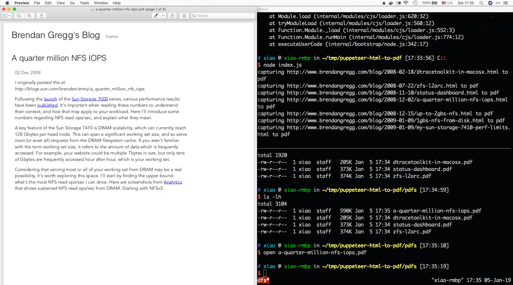

## Notice

I just changed the program to spider down articles from [Microsoft Azure Architecture Center](https://github.com/xiaohanyu/blog-html-to-pdf/blob/master/Microsoft.md). So if you want to spider down Brendan Gregg's articles with the program as documented in this README, please `git reset --hard d8cc3c2`, enjoy.

## Introduction

One of my friends is a fan of [Brendan Gregg] (http://www.brendangregg.com/)
(ah, me too) and wants to save all his [blog](http://www.brendangregg.com/blog/)
posts as a PDF, put it on kindle, thus can read it offline anytime. So the
problem is whether there are some good ways to convert 130 articles from HTML
to PDF.

With a simple thought, there are three steps to solve this problem:

- Get the URL of 130 blog posts
- Convert each article from HTML to PDF
- Finally, combine the converted PDF into a single large PDF file

The first two steps is more important and hard than the third.

### Get the URL of all blog posts

The first step is to get all the URLs of a website or multiple websites, which
is essentially a crawler problem. [wget](https://www.gnu.org/software/wget/) is
a very powerful download tool. In addition to downloading a single file, wget can
also download an entire website and convert all links of the website to local
links.

We use the following command to get all the links of brendan gregg's website:

```sh
wget --spider -r http://www.brendangregg.com/blog/ 2>&1 | grep '^--' | awk '{ print $3 }' | grep -v '\.\(css\|js\ |png\|gif\|jpg\|JPG\)$' > /tmp/urls.txt
```

We found that the URL of brendan gregg's blog posts is very regular:

```
Http://www.brendangregg.com/blog/2008-12-02/a-quarter-million-nfs-iops.html
Http://www.brendangregg.com/blog/2008-12-15/up-to-2gbs-nfs.html
Http://www.brendangregg.com/blog/2008-12-15/up-to-2gbs-nfs.html
Http://www.brendangregg.com/blog/2009-01-09/1gbs-nfs-from-disk.html
Http://www.brendangregg.com/blog/2009-01-09/1gbs-nfs-from-disk.html
```

So we use the following command to filter out the URLs of all blog posts:

```
cat /tmp/urls.txt | grep 'blog/2' | grep '.html$' | sort | uniq > blog.txt
```

Done to first step.

### Converting an article from HTML to PDF

Next, we're going to convert all 130 articles from HTML to PDF.

Obviously, it is impossible to do it by hand. And batch conversion must use
[headless browser](https://en.wikipedia.org/wiki/Headless_browser).

The de facto standard for headless browsers in the past few years was
[PhantomJS](http://phantomjs.org/), but later the Chrome team released the
killer [puppeteer](https://github.com/GoogleChrome/puppeteer), which basically
declared the death of PhantomJS.

We can use the following code to convert an HTML page to a PDF:

```js
const puppeteer = require('puppeteer');

(async () => {
  const browser = await puppeteer.launch();
  const page = await browser.newPage();
  await page.goto('https://news.ycombinator.com', {waitUntil: 'networkidle2'});
  await page.pdf({path: 'hn.pdf', format: 'A4'});

  await browser.close();
})();
```

With some small [modifications](https://github.com/xiaohanyu/blog-html-to-pdf/blob/master/index.js#L26-L40),
we can convert all 130 blog posts to PDF.

Better to pay some attention to following issues:

- Writing asynchronous code in JS is not easy in traditional way. If possible,
  use `async`/`await` instead, feels much better
- Puppeteer is essentially a chrome. If there are too many open pages, it is
  quite resource-intensive. Thus it's necessary to control the frequency of
  converting HTML to PDF, you need to close the page after each conversion, and
  better `sleep(10000)`. My first version of the code didn't notice this problem
  and disabled the headerless option
  (`const browser = await puppeteer.launch({headless: false}`)) for debugging
  purpose,  which directly caused the computer's memory to be exhausted, here's
  a screenshot of my computer where there're tens of chromium running at the
  same time:


The full conversion code is [here](https://github.com/xiaohanyu/blog-html-to-pdf/blob/master/index.js).

run:

```sh
yarn
mkdir output
node index.js
```



### Merge PDF

It takes about ten minutes to get all PDFs of about 130 posts, after that we
merge 130 PDFs into one large PDF file, for easy management and reading on
mobile devices.

There are quite a lot of tools for merging PDFs, such as Adobe Acrobat, and
command line tools like [PDFtk](https://www.pdflabs.com/tools/pdftk-the-pdf-toolkit/).

On Mac, there's [ghostscript](https://www.ghostscript.com/):

```sh
brew install ghostscript
```

Merge PDFs with the following command:

```sh
gs -q -dNOPAUSE -dBATCH -sDEVICE=pdfwrite -sOutputFile=merged.pdf pdf1.pdf pdf2.pdf
```

We use the `ls -t` command to list all PDF files and sort them according to the
file's modifed time (`man ls` command to check the meaning of the `-t`
argument).

So, we get the following command:

```sh
gs -q -dNOPAUSE -dBATCH -sDEVICE=pdfwrite -sOutputFile=merged.pdf `ls -t`
```

In about a minute or two, 130 PDFs are combined into one 640+ pages PDF.
We provide two versions for downloading:

- [brendan-gregg-sort-by-alpha.pdf](https://github.com/xiaohanyu/blog-html-to-pdf/blob/master/dist/brendan-gregg-sort-by-alpha.pdf )
- [brendan-gregg-sort-by-date.pdf](https://github.com/xiaohanyu/blog-html-to-pdf/blob/master/dist/brendan-gregg-sort-by-date.pdf )


### Homework

First, in fact, if you read the merged PDF on a small-sized device like kindle,
the convertion argument of the puppeteer can be changed. My settings in the
program will convert HTML to PDF based on A4 paper size. If I put it on kindle,
I can change the size from A4 to A5 paper size for better reading. In this case,
we can see that the way of the web typesetting is
[streaming typsetting](https://www.douban.com/note/575242910/)---yeah, I
authored this word---shows a huge advantage in adapting to different sizes of
devices.

Second, if you do a similar web service, will someone be willing to pay?

Third, [the strength of the tool is invincible](https://blog.youxu.info/2008/03/10/tools-everywhere/)......